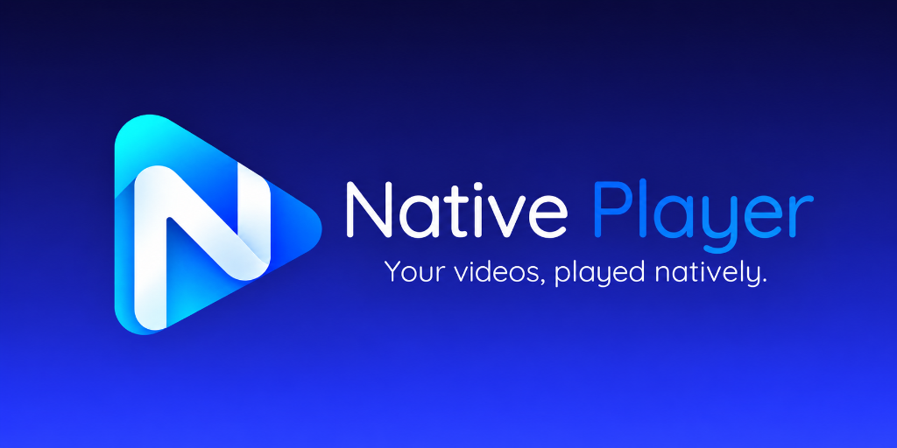

<div align="center">

  

  <br />
  <br />

  <p align="center">
    <a href="https://github.com/rajparmar07/StreamCache_VideoPlayer/releases"></a>
    <a href="https://kotlinlang.org/"></a>
    <a href="https://developer.android.com/jetpack/compose"></a>
    <a href="https://developer.android.com/media/media3"></a>
    <a href="https://buymeacoffee.com/rajparmar07"></a>
    <a href="LICENSE"></a>
  </p>

  <p align="center">
    <a href="#-key-features">Key Features</a> •
    <a href="#-supported-formats--codecs">Supported Formats</a> •
    <a href="#-theming--customization">Theming</a> •
    <a href="#-gestures--controls">Gestures</a> •
    <a href="#-tech-stack">Tech Stack</a> •
    <a href="#-building-from-source">Building</a> •
    <a href="#-support--donate">Support</a>
  </p>

</div>

---

## 📖 Overview

**Native Player** is a native video player engineered from the ground up for Android. Powered by **AndroidX Media3 ExoPlayer** and enhanced with **Jellyfin FFmpeg software decoders**, Native Player delivers smooth video playback, robust multi-format codec compatibility, fluid gesture navigation, an intelligent local video library manager, playlist curation, direct video bookmarking, network stream playback, and a built-in offline video downloader.

Built with modern **Material Design 3 (Material You)**, Native Player adapts dynamically to your system wallpaper or offers 6 custom hand-crafted color palettes, plus a pure **High Contrast OLED Black mode** for maximum battery efficiency and punchy contrast.

---

## ✨ Key Features

### 🎬 High-Performance Media Playback
- **Universal Codec & Container Support**: Plays MP4, MKV, WebM, AVI, TS, FLV, MOV, 3GP, and more.
- **Hardware & Software Decoders**: Leverages device hardware acceleration with automatic software fallback via **Jellyfin FFmpeg** for advanced audio/video tracks (MKV, AC3, DTS, EAC3, TrueHD, FLAC, Opus).
- **Adaptive Network Streaming**: Smooth playback for HTTP/HTTPS live streams, **HLS** (`.m3u8`), **DASH** (`.mpd`), and **SmoothStreaming**.
- **Fast Seek (Keyframe Snapping)**: Instantaneous, buffer-free seeking by snapping to keyframes, with an option for frame-accurate exact seeking.
- **Variable Playback Speed**: Finely tune playback speed from **0.25× up to 4.0×** with a smooth step slider.
- **Aspect Ratio Modes**: Seamlessly toggle between *Fit to Screen*, *Fill*, *Zoom / Crop*, *16:9*, *4:3*, and *Stretch*.
- **Audio Focus Management**: Automatically pauses when external audio plays or calls arrive, resumes cleanly, and ducks volume during notifications.
- **Headset & Bluetooth Disconnect**: Auto-pause safeguard when headphones or Bluetooth audio devices disconnect.
- **Picture-in-Picture (PiP)**: Seamless multitasking with full background audio and floating window playback.
- **Multi-Track Audio & Subtitle Selector**: Switch between embedded audio streams and subtitle tracks (SRT, ASS/SSA, VTT, SubRip).
- **Resume from Last Left**: Remembers playback progress individually for every video with instant resumption.

### 👆 Intuitive Touch Gestures
- **Vertical Swipe (Left Side)**: Smooth brightness control with on-screen percentage indicator.
- **Vertical Swipe (Right Side)**: Linear volume adjustment with on-screen level indicator.
- **Horizontal Swipe**: Scrub and seek forward/backward with real-time timestamp preview and configurable step intervals (1s to 10s).
- **Double-Tap Seeking**: Double-tap on left/right screen edges for quick 5s/10s seeking.
- **Pinch-to-Zoom & Pan**: Freely zoom into any area of a video and pan across the frame.
- **Touch Lock**: Lock on-screen controls to avoid accidental inputs during playback.
- **Custom Controller Timeout**: Configure on-screen player controls auto-hide duration (1s to 12s).

### 📁 Smart Local Library & File Manager
- **Hierarchical Directory & Folder Tree**: Browse local storage by folder or deep recursive directory trees with breadcrumb path navigation.
- **Grid & List Display Styles**: Switch between flexible Grid layout (1 to 4 columns) and List layout with Compact or Advanced metadata tiles (resolution, duration, file size, date).
- **Multi-Select Batch Actions**: Select multiple videos to bookmark, add to playlists, move, copy, rename, delete, or inspect detailed media properties.
- **Duplicate File Detection**: Built-in duplicate detection and collision resolution during file operations.
- **High-Performance Thumbnail Cache**: Dual-layer disk and in-memory thumbnail caching for smooth scrolling without stutter.

### 📋 Playlists & Instant Bookmarks
- **Custom Playlists**: Create, reorder, manage, and curate custom video playlists.
- **One-Tap Bookmarks**: Direct bookmark action on single or multi-selected videos with dynamic state tracking (Bookmarked / Bookmark).
- **Custom Cover Images**: Set custom playlist covers directly from your gallery or choose from 4 automatic layout patterns (*Single, Grid, Stack, Fan*).
- **Clean Separation**: Smart exclusion keeping bookmarks cleanly accessible without cluttering custom playlists.

### 🌐 Network Streaming & Offline Downloads
- **Direct Stream URL Playback**: Input direct HTTP, HTTPS, HLS, or DASH links to stream immediately.
- **Offline Download Manager**: Download remote videos directly to your device storage with real-time progress indicators, background execution, and pause/resume capabilities.

### 💾 Storage & Cache Tools
- **Real-Time Cache Monitoring**: Inspect memory and disk space consumed by cached thumbnails and video streaming buffers.
- **One-Tap Cache Cleanup**: Safely purge thumbnail cache with automatic background regeneration.

---

## 🎨 Theming & Customization

Native Player features a deeply integrated **Material Design 3** theming system:

| Mode / Palette | Description |
| :--- | :--- |
| **System Default** | Dynamically follows Android 12+ Material You dynamic wallpaper colors. |
| **Light Theme** | Clean, high-contrast, modern daylight aesthetic. |
| **Dark Theme** | Deep slate night theme engineered for low-light viewing. |
| **High Contrast OLED Dark** | Pure `#000000` pitch-black mode for maximum AMOLED power efficiency and stunning contrast. |
| **Sage Mint** | Calm, natural botanical greens. |
| **Soft Lavender** | Elegant, soothing pastel purple tones. |
| **Warm Sand** | Earthy amber, warm terracotta, and gold accents. |
| **Ocean Slate** | Crisp nautical teal and deep oceanic blue. |
| **Nordic Indigo** | Modern Scandinavian royal indigo palette. |
| **Rose Quartz** | Sophisticated blush, warm rose, and coral tones. |

- **Scalable Typography**: Adjust font sizes globally across the application (*Small, Normal, Large, Extra Large*).
- **Custom Theme-Aware Snackbars**: Unified, non-intrusive feedback indicators replacing standard OS toast popups.

---

## 📱 Supported Formats & Codecs

| Category | Formats & Codecs Supported |
| :--- | :--- |
| **Video Containers** | MP4, MKV, WebM, AVI, 3GP, FLV, TS, M2TS, MOV, OGV, WMV |
| **Video Codecs** | H.264 (AVC), H.265 (HEVC), VP8, VP9, AV1, MPEG-4, MPEG-2, Motion JPEG |
| **Audio Codecs** | AAC, AC3 (Dolby Digital), EAC3 (Dolby Digital Plus), DTS, DTS-HD, TrueHD, MP3, Opus, Vorbis, FLAC, ALAC, PCM |
| **Streaming Protocols** | HLS (`.m3u8`), DASH (`.mpd`), SmoothStreaming, Progressive HTTP/HTTPS |
| **Subtitle Formats** | SRT, ASS/SSA, VTT, TTML, SubRip, Embedded MKV Subtitles |

---

## 🛠️ Tech Stack & Architecture

Native Player is built using industry-standard Android architecture and modern Jetpack libraries:

- **Language**: [Kotlin](https://kotlinlang.org/) (100%)
- **UI Framework**: [Jetpack Compose](https://developer.android.com/jetpack/compose) with Material Design 3
- **Media Engine**: [AndroidX Media3 ExoPlayer 1.5.0](https://developer.android.com/media/media3) + [Jellyfin FFmpeg Decoder Extension](https://github.com/jellyfin/jellyfin-media3-ffmpeg-decoder)
- **Architecture**: MVVM / MVI with unidirectional data flow (UDF)
- **Asynchronous & Concurrency**: [Kotlinx Coroutines](https://github.com/Kotlin/kotlinx.coroutines) & `StateFlow` / `SharedFlow`
- **Local Persistence**: [AndroidX Room Database](https://developer.android.com/jetpack/androidx/releases/room) with SQLite
- **Key-Value Storage**: [AndroidX DataStore Preferences](https://developer.android.com/topic/libraries/architecture/datastore)
- **Image Loading**: [Coil Compose](https://coil-kt.github.io/coil/)
- **Networking**: [Retrofit 2](https://square.github.io/retrofit/) & [OkHttp 3](https://square.github.io/okhttp/)
- **Permissions**: [Google Accompanist Permissions](https://google.github.io/accompanist/permissions/)
- **Unit & Screenshot Testing**: [Robolectric](https://robolectric.org/) & [Roborazzi](https://github.com/takahirom/roborazzi)

---

## 🚀 Building from Source

### Prerequisites
- **JDK 17** or higher
- **Android Studio Ladybug (2024.2.1+)** or newer
- **Android SDK** with `compileSdk = 35` and `minSdk = 26` (Android 8.0 Oreo+)

### Steps

1. **Clone the repository:**
   ```bash
   git clone https://github.com/rajparmar07/StreamCache_VideoPlayer.git
   cd StreamCache_VideoPlayer
   ```

2. **Open the project in Android Studio:**
   - Launch Android Studio.
   - Select **Open** and choose the `StreamCache_VideoPlayer` directory.
   - Wait for Gradle sync to download dependencies.

3. **Build the debug APK:**
   ```bash
   # On Windows (PowerShell / Command Prompt)
   .\gradlew.bat assembleDebug

   # On macOS / Linux
   ./gradlew assembleDebug
   ```

4. **Run Unit Tests:**
   ```bash
   .\gradlew.bat testDebugUnitTest
   ```

---

## ☕ Support & Donate

Native Player is a completely free, open-source project developed with passion. If Native Player has improved your media viewing experience and you would like to support development, consider buying a coffee!

<p align="center">
  <a href="https://buymeacoffee.com/rajparmar07" target="_blank">
    
  </a>
</p>

> *Fuel late-night bug hunting & caffeine-driven features! ☕*

---

## 🤝 Contributing & Bug Reports

Contributions, feature suggestions, and pull requests are warmly welcomed!

1. Fork the Project repository.
2. Create your Feature Branch (`git checkout -b feature/AmazingFeature`).
3. Commit your Changes (`git commit -m 'Add some AmazingFeature'`).
4. Push to the Branch (`git push origin feature/AmazingFeature`).
5. Open a **Pull Request**.

If you discover a bug or have an idea for improvement, please open an issue in the [GitHub Issues](https://github.com/rajparmar07/StreamCache_VideoPlayer/issues) tab.

---

## 👤 Author

**Raj Parmar**
- **GitHub**: [@rajparmar07](https://github.com/rajparmar07)
- **Buy Me a Coffee**: [rajparmar07](https://buymeacoffee.com/rajparmar07)

---

## 📄 License

```text
Copyright 2026 Raj Parmar

Licensed under the Apache License, Version 2.0 (the "License");
you may not use this file except in compliance with the License.
You may obtain a copy of the License at

    http://www.apache.org/licenses/LICENSE-2.0

Unless required by applicable law or agreed to in writing, software
distributed under the License is distributed on an "AS IS" BASIS,
WITHOUT WARRANTIES OR CONDITIONS OF ANY KIND, either express or implied.
See the License for the specific language governing permissions and
limitations under the License.
```
